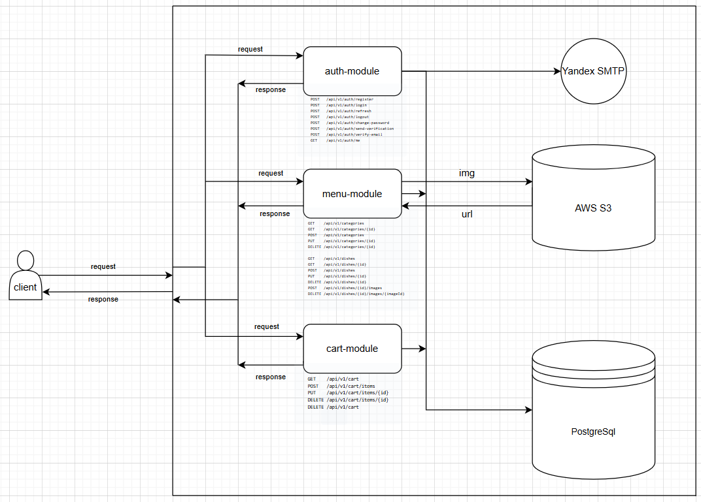

# Архитектура Azhur Katering

## Основные функции

### Для пользователей:
- **Регистрация и авторизация** с email верификацией
- **Просмотр меню блюд** с фильтрацией по категориям
- **Добавление блюд в корзину** с сохранением между сессиями
- **Оформление заказов** с указанием доставки
- **Просмотр истории заказов** в личном кабинете (на рассмотрение)
- **Оставление отзывов**

### Для администраторов:
- **Управление блюдами** (CRUD операции)
- **Управление категориями** блюд
- **Обработка заказов** с изменением статусов
- **Модерация отзывов** пользователей
- **Аналитика и отчеты** по продажам

## Архитектура системы

### Тип архитектуры: **Монолит с модульной структурой**



## Технологический стек

### База данных:
- **PostgreSQL** - Основная БД
- **Flyway** - Миграции БД

### Инфраструктура:
- **Docker** - Контейнеризация
- **AWS S3** - Хранение изображений

## Схема базы данных


## API Endpoints

### Аутентификация:
```
POST   /api/v1/auth/register          # Регистрация пользователя
POST   /api/v1/auth/login             # Вход в систему
POST   /api/v1/auth/refresh           # Обновление токена
POST   /api/v1/auth/logout            # Выход из системы
POST   /api/v1/auth/change-password   # Смена пароля
POST   /api/v1/auth/send-verification # Отправка кода верификации
POST   /api/v1/auth/verify-email      # Подтверждение email
GET    /api/v1/auth/me                # Информация о текущем пользователе
```

### Меню и блюда:
```
GET    /api/v1/categories             # Список категорий
GET    /api/v1/categories/{id}        # Детали категории
POST   /api/v1/categories             # Создание категории (ADMIN)
PUT    /api/v1/categories/{id}        # Обновление категории (ADMIN)
DELETE /api/v1/categories/{id}        # Удаление категории (ADMIN)

GET    /api/v1/dishes                 # Список блюд с фильтрацией
GET    /api/v1/dishes/{id}            # Детали блюда
POST   /api/v1/dishes                 # Создание блюда (ADMIN)
PUT    /api/v1/dishes/{id}            # Обновление блюда (ADMIN)
DELETE /api/v1/dishes/{id}            # Удаление блюда (ADMIN)
POST   /api/v1/dishes/{id}/images     # Загрузка изображения (ADMIN)
DELETE /api/v1/dishes/{id}/images/{imageId} # Удаление изображения (ADMIN)
```
### Корзина:
```
GET    /api/v1/cart                   # Получить корзину пользователя
POST   /api/v1/cart/items             # Добавить блюдо в корзину
PUT    /api/v1/cart/items/{id}        # Обновить количество
DELETE /api/v1/cart/items/{id}        # Удалить из корзины
DELETE /api/v1/cart                   # Очистить корзину
```
### Отзывы:
```
GET    /api/v1/reviews    # Отзывы
POST   /api/v1/reviews    # Оставить отзыв
PUT    /api/v1/reviews/{id}           # Обновить отзыв
DELETE /api/v1/reviews/{id}           # Удалить отзыв
GET    /api/v1/admin/reviews          # Все отзывы (ADMIN)
PUT    /api/v1/admin/reviews/{id}/approve # Одобрить отзыв (ADMIN)
```

Если потребуется
### Заказы:
```
GET    /api/v1/orders                 # История заказов пользователя
GET    /api/v1/orders/{id}            # Детали заказа
POST   /api/v1/orders                 # Создать заказ
PUT    /api/v1/orders/{id}/status     # Обновить статус (ADMIN)
GET    /api/v1/admin/orders           # Все заказы (ADMIN)
```


