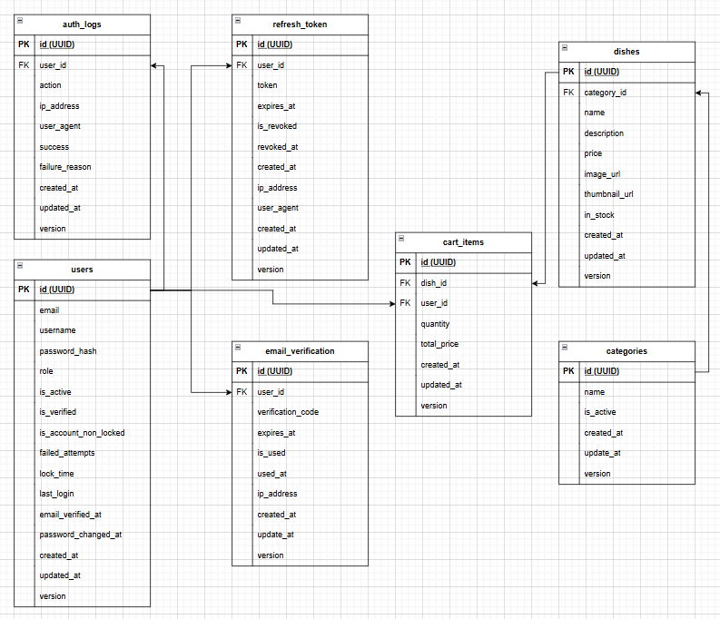

# Полная схема базы данных




## Детальное описание таблиц

### **Таблица пользователей (users)**

```sql
CREATE TABLE users (
    id UUID PRIMARY KEY,
    username VARCHAR(50) UNIQUE NOT NULL,
    email VARCHAR(100) UNIQUE NOT NULL,
    password_hash VARCHAR(255) NOT NULL,
    role VARCHAR(20) NOT NULL DEFAULT 'USER', -- USER, ADMIN
    is_active BOOLEAN DEFAULT true,
    is_verified BOOLEAN DEFAULT false,
    is_account_non_locked BOOLEAN DEFAULT true,
    failed_attempts INTEGER DEFAULT 0,
    lock_time TIMESTAMP,
    last_login TIMESTAMP,
    email_verified_at TIMESTAMP,
    password_changed_at TIMESTAMP,
    created_at TIMESTAMP DEFAULT CURRENT_TIMESTAMP,
    updated_at TIMESTAMP DEFAULT CURRENT_TIMESTAMP,
    version BIGINT DEFAULT 0
);
```

**Назначение:** Хранение информации о пользователях системы
**Ключевые поля:**
- `role` - роль пользователя (USER, ADMIN)
- `is_verified` - подтвержден ли email
- `is_account_non_locked` - заблокирован ли аккаунт
- `failed_attempts` - количество неудачных попыток входа
- `version` - для оптимистичной блокировки

### **Таблица refresh токенов (refresh_tokens)**

```sql
CREATE TABLE refresh_tokens (
    id UUID PRIMARY KEY,
    user_id UUID NOT NULL REFERENCES users(id) ON DELETE CASCADE,
    token VARCHAR(1000) UNIQUE NOT NULL,
    expires_at TIMESTAMP NOT NULL,
    is_revoked BOOLEAN DEFAULT false,
    revoked_at TIMESTAMP,
    ip_address VARCHAR(45),
    user_agent TEXT,
    created_at TIMESTAMP DEFAULT CURRENT_TIMESTAMP,
    updated_at TIMESTAMP DEFAULT CURRENT_TIMESTAMP,
    version BIGINT DEFAULT 0
);
```

**Назначение:** Хранение refresh токенов для JWT аутентификации
**Ключевые поля:**
- `token` - сам refresh токен
- `expires_at` - время истечения токена
- `is_revoked` - отозван ли токен
- `ip_address` - IP адрес устройства
- `user_agent` - информация о браузере

### **Таблица верификации email (email_verifications)**

```sql
CREATE TABLE email_verifications (
    id UUID PRIMARY KEY,
    user_id UUID REFERENCES users(id) ON DELETE CASCADE,
    verification_code VARCHAR(10) NOT NULL,
    expires_at TIMESTAMP NOT NULL,
    is_used BOOLEAN DEFAULT false,
    used_at TIMESTAMP,
    ip_address VARCHAR(45),
    created_at TIMESTAMP DEFAULT CURRENT_TIMESTAMP,
    updated_at TIMESTAMP DEFAULT CURRENT_TIMESTAMP,
    version BIGINT DEFAULT 0
);
```

**Назначение:** Хранение кодов верификации email
**Ключевые поля:**
- `verification_code` - код подтверждения
- `expires_at` - время истечения кода
- `is_used` - использован ли код
- `ip_address` - IP адрес запроса

### **Таблица категорий (categories)**

```sql
CREATE TABLE categories (
    id UUID PRIMARY KEY DEFAULT gen_random_uuid(),
    name VARCHAR(100) NOT NULL UNIQUE,
    is_active BOOLEAN DEFAULT true,
    created_at TIMESTAMP DEFAULT CURRENT_TIMESTAMP,
    updated_at TIMESTAMP DEFAULT CURRENT_TIMESTAMP
);
```

**Назначение:** Категории блюд для организации меню
**Ключевые поля:**
- `name` - название категории (Основные блюда, Закуски, Салаты)
- `is_active` - активна ли категория

### **Таблица блюд (dishes)**

```sql
CREATE TABLE dishes (
    id UUID PRIMARY KEY DEFAULT gen_random_uuid(),
    name VARCHAR(200) NOT NULL,
    description TEXT,
    price DECIMAL(10,2) NOT NULL, CHECK (price >= 0) ,
    category_id UUID REFERENCES categories(id) ON DELETE RESTRICT,
    image_url VARCHAR(500),
    thumbnail_url VARCHAR(500),
    is_available BOOLEAN DEFAULT true,
    created_at TIMESTAMP DEFAULT CURRENT_TIMESTAMP,
    updated_at TIMESTAMP DEFAULT CURRENT_TIMESTAMP,
    version BIGINT DEFAULT 0
);
```

**Назначение:** Хранение информации о блюдах
**Ключевые поля:**
- `price` - цена блюда
- `image_url` - URL основного изображения в S3
- `thumbnail_url` - URL миниатюры для быстрой загрузки
- `in_stock` - в наличии ли блюдо 

### **Таблица корзины (cart_items)**

```sql
CREATE TABLE cart_items (
    id UUID PRIMARY KEY DEFAULT gen_random_uuid(),
    user_id UUID NOT NULL REFERENCES users(id) ON DELETE CASCADE,
    dish_id UUID NOT NULL REFERENCES dishes(id) ON DELETE CASCADE,
    quantity INTEGER NOT NULL DEFAULT 1,
    created_at TIMESTAMP DEFAULT CURRENT_TIMESTAMP,
    updated_at TIMESTAMP DEFAULT CURRENT_TIMESTAMP,
    version BIGINT DEFAULT 0
);
```

**Назначение:** Хранение товаров в корзине пользователя
**Ключевые поля:**
- `quantity` - количество блюд


## Связи между таблицами

### **Основные связи:**
- `users` → `refresh_tokens` (1:N) - пользователь может иметь несколько refresh токенов
- `users` → `email_verifications` (1:N) - пользователь может запрашивать несколько кодов
- `users` → `cart_items` (1:N) - пользователь может иметь несколько товаров в корзине

- `categories` → `dishes` (N:N) - категория содержит множество блюд
- `dishes` → `cart_items` (1:N) - блюдо может быть в нескольких корзинах

## Индексы для оптимизации

### **Основные индексы:**
```sql
-- Пользователи
CREATE INDEX idx_users_email ON users(email);
CREATE INDEX idx_users_username ON users(username);

-- Refresh токены
CREATE INDEX idx_refresh_tokens_token ON refresh_tokens(token);
CREATE INDEX idx_refresh_tokens_user_expires ON refresh_tokens(user_id, expires_at) WHERE is_revoked = false;

-- Верификация email
CREATE INDEX idx_email_verifications_user_id ON email_verifications(user_id);
CREATE INDEX idx_email_verifications_email_code ON email_verifications(user_id, verification_code) WHERE is_used = false;

-- Категории
CREATE INDEX idx_categories_name ON categories(name);
CREATE INDEX idx_categories_active ON categories(is_active);

-- Блюда
CREATE INDEX idx_dishes_category ON dishes(category_id);
CREATE INDEX idx_dishes_available ON dishes(is_available);

-- Корзина
CREATE INDEX idx_cart_items_user ON cart_items(user_id);
CREATE INDEX idx_cart_items_user_dish ON cart_items(user_id, dish_id);
```